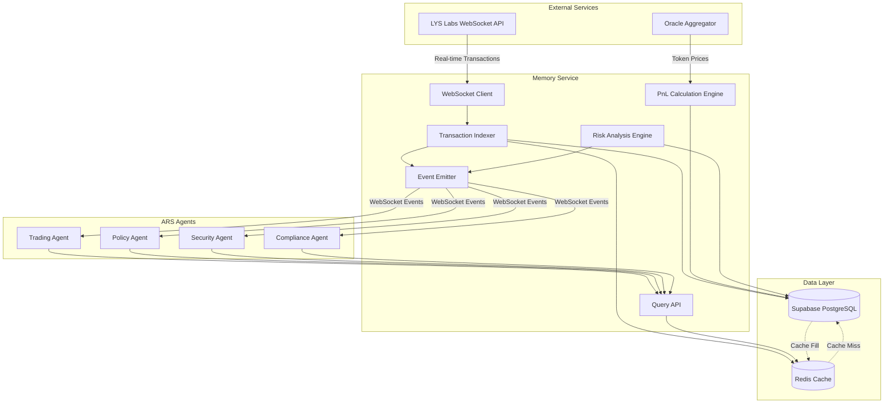

# Design Document: Solder Cortex Supabase Integration

## Overview

The Solder Cortex Supabase Integration extends the Agentic Reserve System (ARS) with a comprehensive memory layer that provides historical context and real-time transaction intelligence to autonomous agents. This design adapts the Solder Cortex architecture to use Supabase (PostgreSQL) as the primary data store instead of ClickHouse, while maintaining integration with LYS Labs for real-time Solana transaction indexing.

The Memory Service acts as a centralized intelligence layer that:
- Indexes wallet transactions in real-time via LYS Labs WebSocket API
- Stores historical transaction data, balances, and analytics in Supabase
- Provides sub-200ms query responses through Redis caching
- Calculates PnL analytics, risk profiles, and prediction market metrics
- Emits real-time events to subscribed agents via WebSocket
- Respects Sipher privacy constraints for stealth addresses

This integration enables all four ARS agents (Trading, Policy, Security, Compliance) to make informed decisions based on historical context rather than operating with limited state awareness.

## Architecture

### High-Level Architecture



### Component Interaction Flow

**Transaction Indexing Flow:**
1. LYS Labs emits transaction event via WebSocket
2. WebSocket Client receives and validates transaction data
3. Transaction Indexer parses transaction and extracts relevant fields
4. Indexer writes to Supabase `wallet_transactions` table
5. Indexer updates `wallet_balances` table with new balance
6. Indexer invalidates relevant Redis cache entries
7. Event Emitter broadcasts `transaction.new` event to subscribed agents

**Query Flow (Cache Hit):**
1. Agent sends query request to Query API
2. Query API constructs cache key from query parameters
3. Query API checks Redis cache
4. Cache returns data (TTL < 5 minutes)
5. Query API returns data to agent (< 200ms)

**Query Flow (Cache Miss):**
1. Agent sends query request to Query API
2. Query API checks Redis cache (miss)
3. Query API queries Supabase with optimized SQL
4. Supabase returns data
5. Query API caches result in Redis with 5-minute TTL
6. Query API returns data to agent

**PnL Calculation Flow:**
1. Cron job triggers PnL Engine every 10 minutes
2. PnL Engine fetches all registered wallets
3. For each wallet, fetch transactions since last calculation
4. Calculate realized PnL using FIFO cost basis
5. Fetch current token prices from Oracle Aggregator
6. Calculate unrealized PnL for open positions
7. Store PnL snapshots in `wallet_pnl` table
8. Invalidate PnL cache entries

## Components and Interfaces

### 1. WebSocket Client (`lys-labs-client.ts`)

**Responsibility:** Maintain persistent WebSocket connection to LYS Labs API and handle transaction stream.

**Interface:**
```typescript
interface LYSLabsClient {
  // Connection management
  connect(): Promise<void>;
  disconnect(): Promise<void>;
  isConnected(): boolean;
  
  // Subscription management
  subscribeWallet(address: string): Promise<void>;
  unsubscribeWallet(address: string): Promise<void>;
  
  // Event handlers
  onTransaction(handler: (tx: LYSTransaction) => void): void;
  onError(handler: (error: Error) => void): void;
  onReconnect(handler: () => void): void;
}

interface LYSTransaction {
  signature: string;
  walletAddress: string;
  timestamp: number;
  type: TransactionType;
  amount: number;
  tokenMint: string;
  metadata: Record<string, any>;
}

enum TransactionType {
  TRANSFER = 'transfer',
  SWAP = 'swap',
  STAKE = 'stake',
  UNSTAKE = 'unstake',
  LIQUIDITY_ADD = 'liquidity_add',
  LIQUIDITY_REMOVE = 'liquidity_remove',
  VOTE = 'vote',
  UNKNOWN = 'unknown'
}
```

**Implementation Details:**
- Uses `ws` library for WebSocket connection
- Implements exponential backoff for reconnection (1s, 2s, 4s, 8s, 16s max)
- Maintains subscription list in memory for re-subscription after reconnect
- Validates incoming messages against expected schema
- Emits events using Node.js EventEmitter pattern

### 2. Transaction Indexer (`transaction-indexer.ts`)

**Responsibility:** Process incoming transactions from LYS Labs and persist to Supabase.

**Interface:**
```typescript
interface TransactionIndexer {
  // Transaction processing
  indexTransaction(tx: LYSTransaction): Promise<void>;
  
  // Batch processing
  indexTransactionBatch(txs: LYSTransaction[]): Promise<void>;
  
  // Historical backfill
  backfillWallet(address: string, fromTimestamp?: number): Promise<void>;
  
  // Status tracking
  getIndexingStatus(address: string): Promise<IndexingStatus>;
}

interface IndexingStatus {
  walletAddress: string;
  status: 'pending' | 'active' | 'error' | 'paused';
  lastIndexedTimestamp: number;
  transactionCount: number;
  errorMessage?: string;
}
```

**Implementation Details:**
- Parses transaction metadata to extract token amounts, counterparties, fees
- Handles transaction deduplication using signature as unique key
- Updates wallet balances atomically using Supabase transactions
- Implements batch insert for historical backfill (100 transactions per batch)
- Tracks indexing progress in `wallet_registrations` table
- Handles privacy-protected transactions by encrypting sensitive fields

### 3. Query API (`memory-query-api.ts`)

**Responsibility:** Provide REST API endpoints for agent queries with caching.

**Interface:**
```typescript
interface MemoryQueryAPI {
  // Transaction queries
  getTransactionHistory(params: TransactionQueryParams): Promise<TransactionPage>;
  getTransaction(signature: string): Promise<Transaction | null>;
  
  // Balance queries
  getWalletBalances(address: string): Promise<WalletBalance[]>;
  getTokenBalance(address: string, mint: string): Promise<TokenBalance | null>;
  
  // PnL queries
  getPnLAnalytics(address: string, periods: TimePeriod[]): Promise<PnLAnalytics>;
  
  // Risk queries
  getRiskProfile(address: string): Promise<RiskProfile>;
  
  // Prediction market queries
  getPredictionMarket(marketAddress: string): Promise<PredictionMarket>;
  getPredictionMarketHistory(marketAddress: string, fromTimestamp: number): Promise<MarketSnapshot[]>;
  
  // Portfolio queries
  getPortfolioAnalytics(address: string): Promise<PortfolioAnalytics>;
}

interface TransactionQueryParams {
  walletAddress: string;
  fromTimestamp?: number;
  toTimestamp?: number;
  types?: TransactionType[];
  tokenMints?: string[];
  minAmount?: number;
  maxAmount?: number;
  page?: number;
  pageSize?: number;
}

interface TransactionPage {
  transactions: Transaction[];
  totalCount: number;
  page: number;
  pageSize: number;
  hasMore: boolean;
}

interface WalletBalance {
  tokenMint: string;
  tokenSymbol: string;
  amount: number;
  usdValue: number;
  lastUpdated: number;
}

interface PnLAnalytics {
  walletAddress: string;
  periods: {
    [key in TimePeriod]: {
      realizedPnL: number;
      unrealizedPnL: number;
      totalPnL: number;
      returnPercentage: number;
    }
  };
  byToken: {
    [tokenMint: string]: {
      realizedPnL: number;
      unrealizedPnL: number;
      totalPnL: number;
    }
  };
  calculatedAt: number;
}

type TimePeriod = '24h' | '7d' | '30d' | 'all';

interface RiskProfile {
  walletAddress: string;
  riskScore: number; // 0-100
  anomalyCount: number;
  highRiskTransactionPercentage: number;
  counterpartyRisk: number;
  riskFactors: {
    largeTransactions: boolean;
    unusualFrequency: boolean;
    knownMaliciousCounterparty: boolean;
    rapidBalanceChanges: boolean;
  };
  lastAssessment: number;
}

interface PredictionMarket {
  marketAddress: string;
  proposalId: string;
  outcomes: {
    [outcome: string]: {
      odds: number;
      volume: number;
      liquidity: number;
    }
  };
  totalVolume: number;
  totalLiquidity: number;
  confidenceScore: number;
  lastUpdated: number;
}

interface PortfolioAnalytics {
  walletAddress: string;
  totalValueUSD: number;
  balances: WalletBalance[];
  allocation: {
    [tokenMint: string]: number; // percentage
  };
  concentrationRisk: number;
  diversificationScore: number;
  liquidityScore: number;
}
```

**Implementation Details:**
- Express.js REST API with TypeScript
- Cache key format: `wallet:{address}:{query_type}:{params_hash}`
- Uses `crypto.createHash('sha256')` for params hash
- Implements query parameter validation using `express-validator`
- Returns 401 for unauthorized privacy-protected queries
- Returns 429 for rate limit exceeded (100 queries/min per agent)
- Implements connection pooling for Supabase (20-100 connections)

### 4. PnL Calculation Engine (`pnl-calculator.ts`)

**Responsibility:** Calculate realized and unrealized PnL for all registered wallets.

**Interface:**
```typescript
interface PnLCalculator {
  // Calculation methods
  calculateRealizedPnL(address: string, fromTimestamp: number, toTimestamp: number): Promise<RealizedPnL>;
  calculateUnrealizedPnL(address: string): Promise<UnrealizedPnL>;
  calculateTotalPnL(address: string, period: TimePeriod): Promise<TotalPnL>;
  
  // Batch calculation
  calculateAllWallets(): Promise<void>;
  
  // Cost basis tracking
  getCostBasis(address: string, tokenMint: string): Promise<CostBasis[]>;
}

interface RealizedPnL {
  walletAddress: string;
  period: TimePeriod;
  byToken: {
    [tokenMint: string]: {
      totalPnL: number;
      trades: Trade[];
    }
  };
  totalPnL: number;
  feesPaid: number;
}

interface UnrealizedPnL {
  walletAddress: string;
  byToken: {
    [tokenMint: string]: {
      amount: number;
      costBasis: number;
      currentValue: number;
      unrealizedPnL: number;
    }
  };
  totalUnrealizedPnL: number;
  priceTimestamp: number;
}

interface TotalPnL {
  walletAddress: string;
  period: TimePeriod;
  realizedPnL: number;
  unrealizedPnL: number;
  totalPnL: number;
  returnPercentage: number;
}

interface CostBasis {
  tokenMint: string;
  amount: number;
  costPerToken: number;
  totalCost: number;
  acquiredAt: number;
}

interface Trade {
  signature: string;
  timestamp: number;
  tokenIn: string;
  amountIn: number;
  tokenOut: string;
  amountOut: number;
  realizedPnL: number;
  fees: number;
}
```

**Implementation Details:**
- Uses FIFO (First In, First Out) cost basis method
- Fetches token prices from existing Oracle Aggregator service
- Runs as cron job every 10 minutes using `node-cron`
- Stores cost basis entries in memory cache for performance
- Handles partial position closes by splitting cost basis entries
- Flags PnL as stale if token price is > 15 minutes old
- Stores PnL snapshots in `wallet_pnl` table with period and timestamp

### 5. Risk Analysis Engine (`risk-analyzer.ts`)

**Responsibility:** Analyze transaction patterns and calculate risk scores.

**Interface:**
```typescript
interface RiskAnalyzer {
  // Risk assessment
  analyzeTransaction(tx: Transaction): Promise<TransactionRisk>;
  calculateWalletRisk(address: string): Promise<RiskProfile>;
  
  // Anomaly detection
  detectAnomalies(address: string): Promise<Anomaly[]>;
  
  // Counterparty analysis
  analyzeCounterparty(address: string): Promise<CounterpartyRisk>;
}

interface TransactionRisk {
  signature: string;
  anomalyScore: number; // 0-100
  isHighRisk: boolean;
  riskFactors: string[];
  flagged: boolean;
}

interface Anomaly {
  transactionSignature: string;
  timestamp: number;
  anomalyType: AnomalyType;
  severity: 'low' | 'medium' | 'high' | 'critical';
  description: string;
  score: number;
}

enum AnomalyType {
  LARGE_AMOUNT = 'large_amount',
  UNUSUAL_FREQUENCY = 'unusual_frequency',
  SUSPICIOUS_COUNTERPARTY = 'suspicious_counterparty',
  RAPID_BALANCE_CHANGE = 'rapid_balance_change',
  UNUSUAL_TIME = 'unusual_time',
  UNKNOWN_TOKEN = 'unknown_token'
}

interface CounterpartyRisk {
  address: string;
  isKnownMalicious: boolean;
  riskScore: number;
  transactionCount: number;
  flaggedTransactions: number;
}
```

**Implementation Details:**
- Calculates z-score for transaction amounts based on wallet history
- Flags transactions > 3 standard deviations as anomalies
- Tracks transaction frequency using sliding window (1h, 24h, 7d)
- Maintains blacklist of known malicious addresses in Supabase
- Calculates wallet risk score as weighted average of risk factors
- Emits `security.anomaly` event when high-risk transaction detected

### 6. Event Emitter (`memory-event-emitter.ts`)

**Responsibility:** Broadcast real-time events to subscribed agents via WebSocket.

**Interface:**
```typescript
interface MemoryEventEmitter {
  // Event emission
  emitTransactionEvent(tx: Transaction): void;
  emitBalanceUpdateEvent(balance: WalletBalance): void;
  emitAnomalyEvent(anomaly: Anomaly): void;
  emitMarketOddsEvent(market: PredictionMarket): void;
  
  // Subscription management
  subscribe(agentId: string, eventTypes: EventType[], walletAddresses?: string[]): string;
  unsubscribe(subscriptionId: string): void;
  
  // Rate limiting
  setRateLimit(agentId: string, eventsPerSecond: number): void;
}

enum EventType {
  TRANSACTION_NEW = 'transaction.new',
  BALANCE_UPDATED = 'balance.updated',
  SECURITY_ANOMALY = 'security.anomaly',
  MARKET_ODDS_CHANGED = 'market.odds_changed',
  PNL_UPDATED = 'pnl.updated',
  SYSTEM_ERROR = 'system.error'
}

interface EventMessage {
  eventType: EventType;
  timestamp: number;
  data: any;
  subscriptionId: string;
}
```

**Implementation Details:**
- Uses existing ARS WebSocket infrastructure
- Implements per-agent rate limiting (100 events/sec default)
- Buffers events when rate limit exceeded, drops oldest events
- Supports wildcard subscription for all wallets (`*`)
- Sends heartbeat ping every 30 seconds to detect disconnections
- Automatically unsubscribes on client disconnect

### 7. Wallet Registration Manager (`wallet-registration.ts`)

**Responsibility:** Manage wallet registration and indexing lifecycle.

**Interface:**
```typescript
interface WalletRegistrationManager {
  // Registration
  registerWallet(params: WalletRegistrationParams): Promise<WalletRegistration>;
  unregisterWallet(address: string): Promise<void>;
  
  // Bulk operations
  registerWalletsBulk(addresses: string[]): Promise<WalletRegistration[]>;
  
  // Status queries
  getRegistration(address: string): Promise<WalletRegistration | null>;
  listRegistrations(filter?: RegistrationFilter): Promise<WalletRegistration[]>;
  
  // Auto-registration
  autoRegisterProtocolWallets(): Promise<void>;
}

interface WalletRegistrationParams {
  address: string;
  privacyProtected?: boolean;
  label?: string;
  agentId?: string;
}

interface WalletRegistration {
  address: string;
  registeredAt: number;
  indexingStatus: IndexingStatus;
  privacyProtected: boolean;
  label?: string;
  agentId?: string;
}

interface RegistrationFilter {
  status?: IndexingStatus['status'];
  privacyProtected?: boolean;
  agentId?: string;
}
```

**Implementation Details:**
- Reads ARS protocol wallet addresses from environment config
- Auto-registers on service startup
- Triggers historical backfill on registration
- Updates indexing status in `wallet_registrations` table
- Subscribes to LYS Labs WebSocket for new registrations
- Supports CSV upload for bulk registration via API endpoint

## Data Models

### Supabase Schema

```sql
-- Wallet registrations
CREATE TABLE wallet_registrations (
  address TEXT PRIMARY KEY,
  registered_at TIMESTAMPTZ NOT NULL DEFAULT NOW(),
  indexing_status TEXT NOT NULL CHECK (indexing_status IN ('pending', 'active', 'error', 'paused')),
  last_indexed_timestamp BIGINT,
  transaction_count INTEGER DEFAULT 0,
  privacy_protected BOOLEAN DEFAULT FALSE,
  label TEXT,
  agent_id TEXT,
  error_message TEXT,
  created_at TIMESTAMPTZ NOT NULL DEFAULT NOW(),
  updated_at TIMESTAMPTZ NOT NULL DEFAULT NOW()
);

CREATE INDEX idx_wallet_registrations_status ON wallet_registrations(indexing_status);
CREATE INDEX idx_wallet_registrations_agent ON wallet_registrations(agent_id);

-- Wallet transactions
CREATE TABLE wallet_transactions (
  signature TEXT PRIMARY KEY,
  wallet_address TEXT NOT NULL REFERENCES wallet_registrations(address),
  timestamp BIGINT NOT NULL,
  block_number BIGINT,
  transaction_type TEXT NOT NULL,
  amount NUMERIC(20, 8),
  token_mint TEXT,
  token_symbol TEXT,
  counterparty_address TEXT,
  fee_amount NUMERIC(20, 8),
  metadata JSONB,
  is_privacy_protected BOOLEAN DEFAULT FALSE,
  encrypted_data TEXT,
  created_at TIMESTAMPTZ NOT NULL DEFAULT NOW()
);

CREATE INDEX idx_wallet_transactions_address ON wallet_transactions(wallet_address);
CREATE INDEX idx_wallet_transactions_timestamp ON wallet_transactions(timestamp DESC);
CREATE INDEX idx_wallet_transactions_type ON wallet_transactions(transaction_type);
CREATE INDEX idx_wallet_transactions_token ON wallet_transactions(token_mint);
CREATE INDEX idx_wallet_transactions_composite ON wallet_transactions(wallet_address, timestamp DESC);

-- Wallet balances
CREATE TABLE wallet_balances (
  id SERIAL PRIMARY KEY,
  wallet_address TEXT NOT NULL REFERENCES wallet_registrations(address),
  token_mint TEXT NOT NULL,
  token_symbol TEXT NOT NULL,
  amount NUMERIC(20, 8) NOT NULL,
  usd_value NUMERIC(20, 2),
  last_updated BIGINT NOT NULL,
  created_at TIMESTAMPTZ NOT NULL DEFAULT NOW(),
  updated_at TIMESTAMPTZ NOT NULL DEFAULT NOW(),
  UNIQUE(wallet_address, token_mint)
);

CREATE INDEX idx_wallet_balances_address ON wallet_balances(wallet_address);
CREATE INDEX idx_wallet_balances_token ON wallet_balances(token_mint);

-- Wallet PnL
CREATE TABLE wallet_pnl (
  id SERIAL PRIMARY KEY,
  wallet_address TEXT NOT NULL REFERENCES wallet_registrations(address),
  period TEXT NOT NULL CHECK (period IN ('24h', '7d', '30d', 'all')),
  realized_pnl NUMERIC(20, 2) NOT NULL,
  unrealized_pnl NUMERIC(20, 2) NOT NULL,
  total_pnl NUMERIC(20, 2) NOT NULL,
  return_percentage NUMERIC(10, 4),
  fees_paid NUMERIC(20, 2),
  by_token JSONB,
  calculated_at BIGINT NOT NULL,
  is_stale BOOLEAN DEFAULT FALSE,
  created_at TIMESTAMPTZ NOT NULL DEFAULT NOW(),
  UNIQUE(wallet_address, period, calculated_at)
);

CREATE INDEX idx_wallet_pnl_address ON wallet_pnl(wallet_address);
CREATE INDEX idx_wallet_pnl_period ON wallet_pnl(period);
CREATE INDEX idx_wallet_pnl_calculated ON wallet_pnl(calculated_at DESC);

-- Prediction markets
CREATE TABLE prediction_markets (
  market_address TEXT PRIMARY KEY,
  proposal_id TEXT NOT NULL,
  outcomes JSONB NOT NULL,
  total_volume NUMERIC(20, 2) NOT NULL,
  total_liquidity NUMERIC(20, 2) NOT NULL,
  confidence_score NUMERIC(5, 2),
  last_updated BIGINT NOT NULL,
  created_at TIMESTAMPTZ NOT NULL DEFAULT NOW(),
  updated_at TIMESTAMPTZ NOT NULL DEFAULT NOW()
);

CREATE INDEX idx_prediction_markets_proposal ON prediction_markets(proposal_id);
CREATE INDEX idx_prediction_markets_updated ON prediction_markets(last_updated DESC);

-- Market snapshots (historical odds)
CREATE TABLE market_snapshots (
  id SERIAL PRIMARY KEY,
  market_address TEXT NOT NULL REFERENCES prediction_markets(market_address),
  outcomes JSONB NOT NULL,
  total_volume NUMERIC(20, 2) NOT NULL,
  total_liquidity NUMERIC(20, 2) NOT NULL,
  snapshot_timestamp BIGINT NOT NULL,
  created_at TIMESTAMPTZ NOT NULL DEFAULT NOW()
);

CREATE INDEX idx_market_snapshots_market ON market_snapshots(market_address);
CREATE INDEX idx_market_snapshots_timestamp ON market_snapshots(snapshot_timestamp DESC);

-- Risk profiles
CREATE TABLE risk_profiles (
  wallet_address TEXT PRIMARY KEY REFERENCES wallet_registrations(address),
  risk_score NUMERIC(5, 2) NOT NULL CHECK (risk_score >= 0 AND risk_score <= 100),
  anomaly_count INTEGER DEFAULT 0,
  high_risk_transaction_percentage NUMERIC(5, 2),
  counterparty_risk NUMERIC(5, 2),
  risk_factors JSONB NOT NULL,
  last_assessment BIGINT NOT NULL,
  created_at TIMESTAMPTZ NOT NULL DEFAULT NOW(),
  updated_at TIMESTAMPTZ NOT NULL DEFAULT NOW()
);

CREATE INDEX idx_risk_profiles_score ON risk_profiles(risk_score DESC);
CREATE INDEX idx_risk_profiles_assessment ON risk_profiles(last_assessment DESC);

-- Anomalies
CREATE TABLE anomalies (
  id SERIAL PRIMARY KEY,
  transaction_signature TEXT NOT NULL REFERENCES wallet_transactions(signature),
  wallet_address TEXT NOT NULL REFERENCES wallet_registrations(address),
  anomaly_type TEXT NOT NULL,
  severity TEXT NOT NULL CHECK (severity IN ('low', 'medium', 'high', 'critical')),
  description TEXT NOT NULL,
  score NUMERIC(5, 2) NOT NULL,
  timestamp BIGINT NOT NULL,
  created_at TIMESTAMPTZ NOT NULL DEFAULT NOW()
);

CREATE INDEX idx_anomalies_wallet ON anomalies(wallet_address);
CREATE INDEX idx_anomalies_severity ON anomalies(severity);
CREATE INDEX idx_anomalies_timestamp ON anomalies(timestamp DESC);

-- Wallet audit trail
CREATE TABLE wallet_audit_trail (
  id SERIAL PRIMARY KEY,
  wallet_address TEXT NOT NULL REFERENCES wallet_registrations(address),
  action_type TEXT NOT NULL,
  agent_id TEXT NOT NULL,
  authorization_status TEXT NOT NULL CHECK (authorization_status IN ('authorized', 'unauthorized', 'pending')),
  query_params JSONB,
  timestamp BIGINT NOT NULL,
  created_at TIMESTAMPTZ NOT NULL DEFAULT NOW()
);

CREATE INDEX idx_audit_trail_wallet ON wallet_audit_trail(wallet_address);
CREATE INDEX idx_audit_trail_agent ON wallet_audit_trail(agent_id);
CREATE INDEX idx_audit_trail_timestamp ON wallet_audit_trail(timestamp DESC);

-- Cost basis tracking (for PnL calculations)
CREATE TABLE cost_basis (
  id SERIAL PRIMARY KEY,
  wallet_address TEXT NOT NULL REFERENCES wallet_registrations(address),
  token_mint TEXT NOT NULL,
  amount NUMERIC(20, 8) NOT NULL,
  cost_per_token NUMERIC(20, 8) NOT NULL,
  total_cost NUMERIC(20, 2) NOT NULL,
  acquired_at BIGINT NOT NULL,
  transaction_signature TEXT NOT NULL,
  created_at TIMESTAMPTZ NOT NULL DEFAULT NOW()
);

CREATE INDEX idx_cost_basis_wallet ON cost_basis(wallet_address);
CREATE INDEX idx_cost_basis_token ON cost_basis(token_mint);
CREATE INDEX idx_cost_basis_acquired ON cost_basis(acquired_at);

-- Known malicious addresses
CREATE TABLE malicious_addresses (
  address TEXT PRIMARY KEY,
  reason TEXT NOT NULL,
  severity TEXT NOT NULL CHECK (severity IN ('low', 'medium', 'high', 'critical')),
  reported_by TEXT,
  reported_at BIGINT NOT NULL,
  created_at TIMESTAMPTZ NOT NULL DEFAULT NOW()
);

CREATE INDEX idx_malicious_addresses_severity ON malicious_addresses(severity);
```

### Redis Cache Schema

**Cache Key Patterns:**
```
wallet:{address}:transactions:{params_hash}  -> TransactionPage (5min TTL)
wallet:{address}:balances                     -> WalletBalance[] (5min TTL)
wallet:{address}:pnl:{period}                 -> PnLAnalytics (5min TTL)
wallet:{address}:risk                         -> RiskProfile (5min TTL)
market:{address}:current                      -> PredictionMarket (5min TTL)
market:{address}:history:{from}               -> MarketSnapshot[] (5min TTL)
wallet:{address}:portfolio                    -> PortfolioAnalytics (5min TTL)
```

**Cache Invalidation Patterns:**
- On new transaction: invalidate `wallet:{address}:*`
- On balance update: invalidate `wallet:{address}:balances`
- On PnL calculation: invalidate `wallet:{address}:pnl:*`
- On risk assessment: invalidate `wallet:{address}:risk`
- On market update: invalidate `market:{address}:*`

## Correctness Properties

*A property is a characteristic or behavior that should hold true across all valid executions of a system—essentially, a formal statement about what the system should do. Properties serve as the bridge between human-readable specifications and machine-verifiable correctness guarantees.*


### Property Reflection

After analyzing all acceptance criteria, I've identified several areas where properties can be consolidated:

**Consolidation Opportunities:**

1. **Query Response Properties (3.2-3.5, 4.1-4.5, 5.1-5.3, 6.3, 7.1-7.2)**: All these test that specific query types return expected data structures. These can be consolidated into a single property about query response completeness.

2. **Event Emission Properties (10.1-10.4)**: All test that specific events are emitted. These can be consolidated into a single property about event emission for state changes.

3. **Cache Behavior Properties (9.1-9.3)**: These test the cache-then-database pattern. Property 9.3 (cache miss round trip) subsumes 9.1 and 9.2.

4. **Registration Lifecycle Properties (11.3-11.4)**: These test the registration state machine. Can be consolidated into a single property about registration lifecycle.

5. **Error Handling Properties (14.1-14.3)**: All test graceful degradation. Can be consolidated into a single property about service resilience.

6. **Metrics Tracking Properties (15.2-15.4)**: All test that metrics are tracked. Can be consolidated into a single property about metrics completeness.

**Properties to Keep Separate:**

- Transaction indexing and storage (2.3, 2.4) - different concerns
- Privacy protection (8.1-8.5) - critical security properties
- PnL calculations (12.1-12.2) - different calculation methods
- Rate limiting (10.7, 13.5) - different rate limit types
- Performance requirements (3.1, 9.2, 13.1) - specific SLAs

### Correctness Properties

Property 1: Transaction Indexing Completeness
*For any* valid transaction received from LYS Labs, when the transaction is indexed, the transaction data SHALL be stored in the `wallet_transactions` table AND the corresponding wallet balance SHALL be updated in the `wallet_balances` table.
**Validates: Requirements 2.3, 2.4**

Property 2: Wallet Subscription Consistency
*For any* wallet registration, the Memory_Service SHALL subscribe to LYS Labs transaction updates for that wallet address AND maintain the subscription across reconnections.
**Validates: Requirements 2.2, 2.6**

Property 3: Transaction Validation
*For any* transaction data received from LYS Labs, the Memory_Service SHALL validate the data against the expected schema before storage, and SHALL reject invalid transactions without affecting other transaction processing.
**Validates: Requirements 2.7, 2.8**

Property 4: WebSocket Reconnection Resilience
*For any* WebSocket connection failure, the Memory_Service SHALL attempt reconnection with exponential backoff (1s, 2s, 4s, 8s, 16s) up to 5 attempts.
**Validates: Requirements 2.5**

Property 5: Query Response Completeness
*For any* agent query (transaction history, PnL analytics, risk profile, balances, prediction markets, portfolio analytics), the Memory_Service SHALL return all required fields as specified in the query interface.
**Validates: Requirements 3.2, 3.3, 3.4, 3.5, 4.1, 4.2, 4.3, 4.5, 5.1, 5.2, 5.3, 6.3, 6.5, 7.1, 7.2**

Property 6: Cached Query Performance
*For any* agent query where data exists in Redis cache and TTL has not expired, the Memory_Service SHALL return the cached data within 200ms.
**Validates: Requirements 3.1, 9.2**

Property 7: Query Filtering Correctness
*For any* transaction history query with filters (transaction type, token mint, amount range, date range), all returned transactions SHALL match ALL specified filter criteria.
**Validates: Requirements 3.7, 7.3**

Property 8: Pagination Consistency
*For any* paginated transaction history query, the union of all pages SHALL equal the complete result set, and no transaction SHALL appear in multiple pages.
**Validates: Requirements 3.6**

Property 9: Cache Round Trip
*For any* query that results in a cache miss, the Memory_Service SHALL fetch data from Supabase, cache the result with 5-minute TTL, and return the data, such that a subsequent identical query within 5 minutes SHALL return cached data.
**Validates: Requirements 9.3**

Property 10: Cache Invalidation on Update
*For any* real-time transaction update received, the Memory_Service SHALL invalidate all cache entries for the affected wallet address.
**Validates: Requirements 9.4**

Property 11: Cache Key Format Consistency
*For any* cache operation, the Memory_Service SHALL use the format `wallet:{address}:{query_type}:{params_hash}` where params_hash is a SHA-256 hash of query parameters.
**Validates: Requirements 9.5**

Property 12: Cache Eviction Under Pressure
*For any* cache state where memory usage exceeds 80%, the Memory_Service SHALL evict least recently used entries until memory usage falls below 80%.
**Validates: Requirements 9.7**

Property 13: Event Emission on State Change
*For any* state change (new transaction, balance update, anomaly detection, market odds change), the Memory_Service SHALL emit the corresponding event type to all subscribed agents.
**Validates: Requirements 10.1, 10.2, 10.3, 10.4**

Property 14: Event Subscription Confirmation
*For any* agent subscription request, the Memory_Service SHALL send a confirmation message with a unique subscription ID.
**Validates: Requirements 10.6**

Property 15: Event Rate Limiting
*For any* agent subscription, the Memory_Service SHALL rate limit event emissions to 100 events per second, buffering or dropping excess events.
**Validates: Requirements 10.7**

Property 16: Privacy Protection Authorization
*For any* query targeting a privacy-protected wallet, the Memory_Service SHALL require a valid authorization token before returning data, and SHALL return an authorization error for unauthorized queries without revealing wallet existence.
**Validates: Requirements 8.2, 8.5**

Property 17: Privacy Protection Data Encryption
*For any* privacy-protected transaction, the Memory_Service SHALL NOT store plaintext transfer amounts AND SHALL store encrypted metadata with agent-specific decryption keys.
**Validates: Requirements 8.3, 8.4**

Property 18: Privacy Flag Persistence
*For any* wallet registered with privacy flag enabled, the Memory_Service SHALL mark it as a stealth address in the `wallet_registrations` table.
**Validates: Requirements 8.1**

Property 19: Registration Lifecycle State Machine
*For any* wallet registration, the indexing status SHALL transition from `pending` → `active` when historical backfill completes, and SHALL remain `active` until unregistration or error.
**Validates: Requirements 11.3, 11.4**

Property 20: Unregistration Data Retention
*For any* wallet unregistration, the Memory_Service SHALL retain all historical data in Supabase AND SHALL stop receiving new transaction updates from LYS Labs.
**Validates: Requirements 11.7**

Property 21: Bulk Registration Atomicity
*For any* bulk wallet registration request (CSV upload or API batch), either all wallets SHALL be registered successfully OR none SHALL be registered (atomic operation).
**Validates: Requirements 11.8**

Property 22: FIFO Cost Basis Calculation
*For any* sequence of buy and sell transactions for a token, the realized PnL SHALL be calculated using FIFO (First In, First Out) cost basis method, where the oldest acquired tokens are sold first.
**Validates: Requirements 12.1**

Property 23: Unrealized PnL Calculation
*For any* open position, the unrealized PnL SHALL equal (current_market_price - average_cost_basis) * position_size, using current prices from the oracle aggregator.
**Validates: Requirements 12.2**

Property 24: PnL Snapshot Completeness
*For any* PnL calculation, the Memory_Service SHALL store snapshots for all four time periods (24h, 7d, 30d, all-time) in the `wallet_pnl` table.
**Validates: Requirements 12.4**

Property 25: Multi-Token PnL Aggregation
*For any* portfolio with multiple tokens, the total portfolio PnL SHALL equal the sum of PnL for each individual token.
**Validates: Requirements 12.5**

Property 26: Stale Price Handling
*For any* PnL calculation where a token price is unavailable, the Memory_Service SHALL use the last known price AND flag the PnL calculation as stale.
**Validates: Requirements 12.6**

Property 27: Fee Inclusion in Realized PnL
*For any* completed trade, the realized PnL SHALL include all fees paid (transaction fees, protocol fees, slippage).
**Validates: Requirements 12.7**

Property 28: Anomaly Score Calculation
*For any* new transaction, the Memory_Service SHALL calculate an anomaly score based on transaction amount (z-score), frequency (sliding window), and recipient patterns (known malicious addresses).
**Validates: Requirements 6.1**

Property 29: Anomaly Flagging and Alerting
*For any* transaction with anomaly score exceeding the configured threshold, the Memory_Service SHALL flag the transaction AND emit a `security.anomaly` event.
**Validates: Requirements 6.2**

Property 30: Malicious Address Flagging
*For any* transaction involving a known malicious address (from `malicious_addresses` table), the Memory_Service SHALL flag the transaction as high-risk.
**Validates: Requirements 6.4**

Property 31: Market Confidence Score Calculation
*For any* prediction market, the confidence score SHALL be calculated as a weighted function of total volume, total liquidity, and odds stability (variance over time).
**Validates: Requirements 5.4**

Property 32: Market Resolution Storage
*For any* prediction market resolution event, the Memory_Service SHALL store the final outcome and settlement data in the `prediction_markets` table.
**Validates: Requirements 5.5**

Property 33: Concurrent Query Performance
*For any* load scenario with up to 1000 concurrent agent queries, the Memory_Service SHALL maintain response times below 500ms for cached queries.
**Validates: Requirements 13.1**

Property 34: Query Rate Limiting
*For any* agent, the Memory_Service SHALL enforce a rate limit of 100 queries per minute, returning HTTP 429 for excess queries.
**Validates: Requirements 13.5**

Property 35: Capacity Overload Response
*For any* query when the service is at capacity, the Memory_Service SHALL return HTTP 503 with a retry-after header.
**Validates: Requirements 13.4**

Property 36: Slow Query Logging
*For any* query with execution time exceeding 1 second, the Memory_Service SHALL log the query with execution time, query parameters, and stack trace.
**Validates: Requirements 13.6**

Property 37: Health Check Completeness
*For any* health check request to `/health`, the Memory_Service SHALL return service status AND dependency health (Supabase, Redis, LYS Labs WebSocket) AND current query load AND connection pool status.
**Validates: Requirements 13.7**

Property 38: Service Resilience Under Dependency Failure
*For any* dependency failure (LYS Labs WebSocket, Supabase, Redis), the Memory_Service SHALL continue serving requests in degraded mode using available data sources.
**Validates: Requirements 14.1, 14.2, 14.3**

Property 39: Write Operation Retry with Exponential Backoff
*For any* failed write operation to Supabase, the Memory_Service SHALL retry up to 3 times with exponential backoff (1s, 2s, 4s).
**Validates: Requirements 14.4**

Property 40: Retry Exhaustion Error Handling
*For any* write operation where all 3 retry attempts fail, the Memory_Service SHALL log the error with full context AND emit a `system.error` event.
**Validates: Requirements 14.5**

Property 41: Circuit Breaker Pattern
*For any* external API call (LYS Labs, Oracle Aggregator), the Memory_Service SHALL implement a circuit breaker that opens after 5 consecutive failures and remains open for 5 minutes.
**Validates: Requirements 14.6**

Property 42: Circuit Breaker Degraded Mode
*For any* query when the circuit breaker is open, the Memory_Service SHALL return a degraded service response using only cached data.
**Validates: Requirements 14.7**

Property 43: Metrics Tracking Completeness
*For any* operation (query, WebSocket message, database operation), the Memory_Service SHALL track relevant metrics (count, latency, error rate, cache hit rate) and expose them at the `/metrics` endpoint.
**Validates: Requirements 15.2, 15.3, 15.4**

Property 44: Error Logging Completeness
*For any* error, the Memory_Service SHALL log the error with stack trace, context information (request parameters, user agent, timestamp), and error severity.
**Validates: Requirements 15.5**

Property 45: Critical Error Alerting
*For any* critical error (database connection failure, circuit breaker open, service crash), the Memory_Service SHALL emit an alert to the configured monitoring system (Prometheus Alertmanager).
**Validates: Requirements 15.7**

## Error Handling

### Error Categories

**1. External Dependency Failures**
- LYS Labs WebSocket disconnection
- Supabase connection failure
- Redis connection failure
- Oracle Aggregator unavailability

**Strategy:** Graceful degradation with circuit breaker pattern. Continue serving cached data and queue write operations for retry.

**2. Data Validation Errors**
- Invalid transaction data from LYS Labs
- Malformed query parameters
- Schema validation failures

**Strategy:** Reject invalid data, log error with context, continue processing other requests. Return 400 Bad Request to clients.

**3. Authorization Errors**
- Unauthorized access to privacy-protected wallets
- Missing or invalid authorization tokens
- Rate limit exceeded

**Strategy:** Return 401 Unauthorized or 429 Too Many Requests. Do not reveal existence of privacy-protected wallets.

**4. Resource Exhaustion**
- Connection pool exhausted
- Cache memory limit exceeded
- Query load exceeds capacity

**Strategy:** Return 503 Service Unavailable with retry-after header. Implement backpressure and load shedding.

**5. Calculation Errors**
- Missing token prices for PnL calculation
- Insufficient transaction history for risk analysis
- Division by zero in metrics calculation

**Strategy:** Use fallback values (last known price, default risk score), flag results as stale or incomplete, log warning.

### Error Response Format

```typescript
interface ErrorResponse {
  error: {
    code: string;
    message: string;
    details?: any;
    timestamp: number;
    requestId: string;
  };
}
```

### Retry Strategy

**Exponential Backoff:**
- Attempt 1: Immediate
- Attempt 2: 1 second delay
- Attempt 3: 2 seconds delay
- Attempt 4: 4 seconds delay
- Max attempts: 3 (for write operations)

**Circuit Breaker:**
- Failure threshold: 5 consecutive failures
- Open duration: 5 minutes
- Half-open test: Single request to test recovery

### Monitoring and Alerting

**Critical Alerts (PagerDuty):**
- Database connection failure > 1 minute
- Circuit breaker open > 5 minutes
- Error rate > 10% for 5 minutes
- Query latency p99 > 1 second for 5 minutes

**Warning Alerts (Slack):**
- Cache hit rate < 80%
- Slow query detected (> 1 second)
- WebSocket reconnection
- Stale PnL calculation (> 15 minutes)

## Testing Strategy

### Dual Testing Approach

The Memory Service requires both unit tests and property-based tests for comprehensive coverage:

**Unit Tests:** Verify specific examples, edge cases, and error conditions
- Schema creation and migration
- API endpoint existence
- Specific error scenarios (connection failure, invalid data)
- Configuration validation
- Startup and shutdown behavior

**Property-Based Tests:** Verify universal properties across all inputs
- Transaction indexing completeness (Property 1)
- Query response correctness (Properties 5, 7, 8)
- Cache behavior (Properties 9, 10, 11, 12)
- Privacy protection (Properties 16, 17, 18)
- PnL calculations (Properties 22, 23, 25, 27)
- Anomaly detection (Properties 28, 29, 30)
- Resilience and error handling (Properties 38, 39, 40, 41, 42)

### Property-Based Testing Configuration

**Library:** `fast-check` (TypeScript property-based testing library)

**Configuration:**
- Minimum 100 iterations per property test
- Seed randomization for reproducibility
- Shrinking enabled for minimal failing examples

**Test Tagging:**
Each property test must include a comment tag referencing the design document property:
```typescript
// Feature: solder-cortex-supabase-integration, Property 1: Transaction Indexing Completeness
test('transaction indexing stores data and updates balance', async () => {
  await fc.assert(
    fc.asyncProperty(
      arbitraryTransaction(),
      async (tx) => {
        await indexer.indexTransaction(tx);
        const stored = await db.getTransaction(tx.signature);
        const balance = await db.getBalance(tx.walletAddress, tx.tokenMint);
        
        expect(stored).toBeDefined();
        expect(balance).toBeDefined();
        expect(balance.amount).toBeGreaterThanOrEqual(0);
      }
    ),
    { numRuns: 100 }
  );
});
```

### Test Organization

```
backend/src/tests/
├── unit/
│   ├── schema.test.ts              # Schema creation tests
│   ├── api-endpoints.test.ts       # API endpoint existence
│   ├── config.test.ts              # Configuration validation
│   └── error-handling.test.ts      # Specific error scenarios
│
├── property/
│   ├── transaction-indexing.test.ts    # Properties 1-4
│   ├── query-api.test.ts               # Properties 5-8
│   ├── cache-behavior.test.ts          # Properties 9-12
│   ├── event-emission.test.ts          # Properties 13-15
│   ├── privacy-protection.test.ts      # Properties 16-18
│   ├── registration.test.ts            # Properties 19-21
│   ├── pnl-calculation.test.ts         # Properties 22-27
│   ├── risk-analysis.test.ts           # Properties 28-30
│   ├── prediction-markets.test.ts      # Properties 31-32
│   ├── performance.test.ts             # Properties 33-37
│   └── resilience.test.ts              # Properties 38-45
│
└── integration/
    ├── lys-labs-integration.test.ts    # LYS Labs WebSocket integration
    ├── supabase-integration.test.ts    # Database integration
    ├── redis-integration.test.ts       # Cache integration
    └── end-to-end.test.ts              # Full workflow tests
```

### Test Data Generators (Arbitraries)

```typescript
// Transaction generator
const arbitraryTransaction = (): fc.Arbitrary<LYSTransaction> => {
  return fc.record({
    signature: fc.hexaString({ minLength: 88, maxLength: 88 }),
    walletAddress: fc.base58String({ minLength: 32, maxLength: 44 }),
    timestamp: fc.integer({ min: 1600000000, max: 2000000000 }),
    type: fc.constantFrom(...Object.values(TransactionType)),
    amount: fc.double({ min: 0, max: 1000000, noNaN: true }),
    tokenMint: fc.base58String({ minLength: 32, maxLength: 44 }),
    metadata: fc.dictionary(fc.string(), fc.anything())
  });
};

// Wallet address generator
const arbitraryWalletAddress = (): fc.Arbitrary<string> => {
  return fc.base58String({ minLength: 32, maxLength: 44 });
};

// Query parameters generator
const arbitraryQueryParams = (): fc.Arbitrary<TransactionQueryParams> => {
  return fc.record({
    walletAddress: arbitraryWalletAddress(),
    fromTimestamp: fc.option(fc.integer({ min: 1600000000, max: 2000000000 })),
    toTimestamp: fc.option(fc.integer({ min: 1600000000, max: 2000000000 })),
    types: fc.option(fc.array(fc.constantFrom(...Object.values(TransactionType)))),
    tokenMints: fc.option(fc.array(fc.base58String({ minLength: 32, maxLength: 44 }))),
    minAmount: fc.option(fc.double({ min: 0, max: 1000000 })),
    maxAmount: fc.option(fc.double({ min: 0, max: 1000000 })),
    page: fc.option(fc.integer({ min: 1, max: 100 })),
    pageSize: fc.option(fc.integer({ min: 10, max: 100 }))
  });
};

// PnL trade sequence generator
const arbitraryTradeSequence = (): fc.Arbitrary<Trade[]> => {
  return fc.array(
    fc.record({
      signature: fc.hexaString({ minLength: 88, maxLength: 88 }),
      timestamp: fc.integer({ min: 1600000000, max: 2000000000 }),
      tokenIn: fc.base58String({ minLength: 32, maxLength: 44 }),
      amountIn: fc.double({ min: 0.01, max: 10000, noNaN: true }),
      tokenOut: fc.base58String({ minLength: 32, maxLength: 44 }),
      amountOut: fc.double({ min: 0.01, max: 10000, noNaN: true }),
      fees: fc.double({ min: 0, max: 100, noNaN: true })
    }),
    { minLength: 1, maxLength: 50 }
  );
};
```

### Integration Test Setup

**Test Environment:**
- Docker Compose with Supabase (PostgreSQL) and Redis
- Mock LYS Labs WebSocket server
- Mock Oracle Aggregator service

**Test Database:**
- Separate test database schema
- Automatic cleanup between tests
- Seeded with test data for consistent results

**Performance Testing:**
- Load testing with `autocannon` (1000 concurrent requests)
- Latency measurement with percentiles (p50, p95, p99)
- Memory profiling with `clinic.js`

### Continuous Integration

**Pre-commit:**
- Linting (ESLint)
- Type checking (TypeScript)
- Unit tests

**CI Pipeline:**
- Unit tests (all)
- Property-based tests (100 iterations)
- Integration tests
- Performance tests (smoke test with 100 concurrent requests)
- Code coverage report (target: 80%)

**Nightly:**
- Extended property-based tests (1000 iterations)
- Full performance test suite
- Security scanning (npm audit, Snyk)
